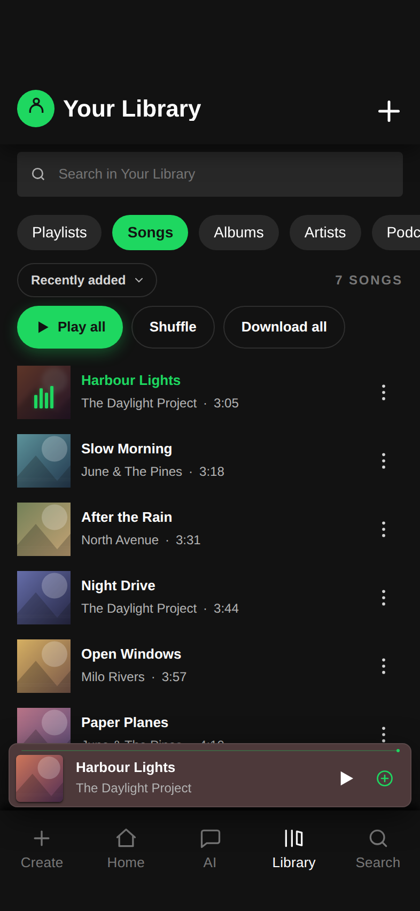
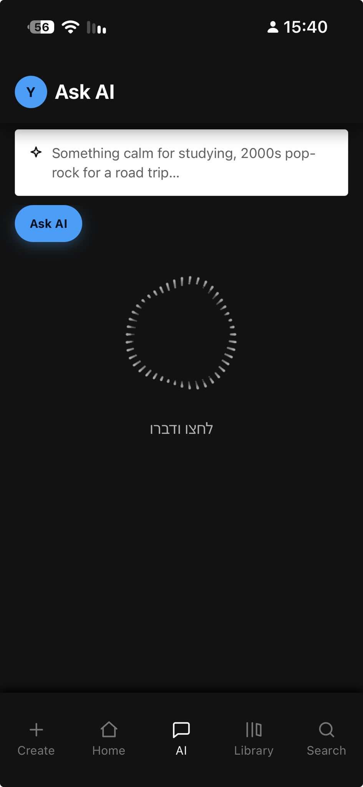
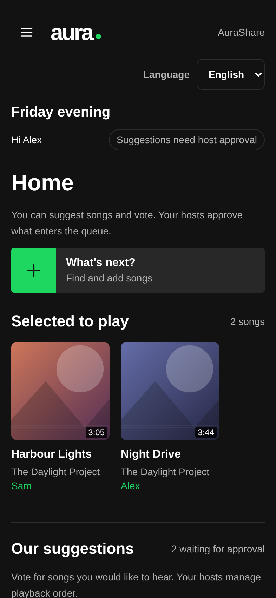

<div align="center">


# Aura

**A music player that just plays music.**

Music, podcasts and playlists in an installable web app.\
Built with vanilla JavaScript, with optional AI features and self-hosting.

[](LICENSE)
[](#quick-start)
[](#development)

[Website](https://yossiyad.github.io/aura/) · [Features](#features) · [Quick start](#quick-start) · [Self-hosting](#self-hosting) · [Documentation](#documentation) · [Contributing](#contributing)

</div>

## About

Aura is an open-source music client that uses [Invidious](https://invidious.io/) and
[Piped](https://github.com/TeamPiped/Piped) instances for search and playback. Find music,
build a library, follow podcasts and take saved tracks offline, from your browser or
home screen.

The client needs no Aura account and includes no analytics or telemetry. Your library
stays on your device by default. For sync, shared listening and server-generated mixes,
you can connect it to services you host yourself.

## Screenshots

| Library | Ask AI | Shared listening |
| --- | --- | --- |
|  |  |  |

*Ask AI is shown on a phone with the Hebrew interface setting. Library and shared listening use fictional demo tracks and guest names.*

## Features

### Music and podcasts

Search for songs, artists, albums and playlists. Home builds recommendations from your
listening history, while the Podcasts tab organizes shows and their latest episodes.
Follow artists and shows to keep them in your library, and resume longer tracks where
you left off.

### Your library, your playlists

Save favorites, create playlists, choose cover images and reorder tracks. Import public
playlists from YouTube, YouTube Music, Spotify or Apple Music. Spotify and Apple Music
entries are matched to tracks available through your configured instances.

Browse your library as a grid or list, look back through your listening history and
stats, or export your library to a JSON backup you can restore later.

### AI playlists and voice requests

Describe what you want to hear, such as *"calm instrumentals for studying"* or
*"an upbeat playlist for a road trip"*. **Ask AI** suggests songs and matches them to
playable tracks. A daily mix offers another starting point based on your listening.

You can also request a song, artist or playlist by voice in Hebrew or English, with
commands to play now, play next or add to the queue. Basic named requests work without
an AI key. Playlist generation and more complex requests use your own
[Gemini or Groq key](docs/ai-providers.md). Voice input depends on browser support;
typed requests are also available.

### Offline listening

Save permitted tracks or playlists for playback without a connection. A size-limited
cache removes the least recently played downloads when it needs room. Downloads stay
on the device that saved them, even when library sync is enabled.

### Playback controls

| Feature | What it does |
| --- | --- |
| Queue | Reorder tracks, play next, shuffle, repeat and set a sleep timer. |
| Autoplay | Continue with related tracks when the queue ends, with an optional music-only filter. |
| Audio settings | Choose stream quality, adjust crossfade and even out volume between tracks. |
| AirPlay & Cast | Send playback to supported speakers and TVs. See the [casting guide](docs/tv-playback.md). |
| Lyrics | Display available lyrics and search words from lyrics already cached on your device. |
| SponsorBlock | Optionally skip known intros, outros and sponsor segments. |
| Driving mode | Use large playback controls and keep the screen awake where supported. |
| Private session | Pause additions to listening history, stats and recommendations. |

### Language choice

Aura starts in **English**. On the first launch it asks which language you want, with
each option written in its own language, and remembers your answer. You can change it
at any time in **Settings > Look > Language · שפה**. English translates the interface
text that otherwise appears in Hebrew; Hebrew preserves the existing mix of Hebrew and
English. AI playlist names, questions from voice requests and spoken replies follow the
same choice. Song titles, artist names and your own text stay unchanged. Speech
recognition has its own language setting. Guests can choose their language on the
invitation page too; until they do, it follows their browser.

### Accessibility

**Settings > Look** also has:

- **Text size** (Default, Large or Larger) enlarges lists, menus, sheets, dialogs and
  toasts.
- **High contrast** brightens secondary text and outlines. It also turns on automatically
  when your device asks for more contrast.
- **Animations** can be turned off, and motion is reduced when your device asks for it.

Keyboard users get visible focus rings, and Escape closes dialogs and sheets. Screen
readers announce toasts and are told which page of the tab bar is showing.

### Shared listening

On a self-hosted installation, invite guests with a QR code. They can suggest songs
and vote from their browser. The host approves participants and chooses whether each
person can add tracks freely, submit them for approval, or only view and vote.

Shared playlists let signed-in listeners build a collection together across devices.
See [shared queue setup](docs/shared-queue.md) for the guest experience and permissions.

## Quick start

The frontend is static HTML, CSS and JavaScript. There is no build step or frontend
package installation. With Git and Python 3 installed:

```sh
git clone https://github.com/YossiYad/aura.git
cd aura
python3 -m http.server 8477
```

Open [localhost:8477](http://localhost:8477). On Windows, you can run `start.bat` instead
with Python or Node.js installed.

To install Aura on your phone, serve it over **HTTPS**, open it in Safari or Chrome and
choose **Add to Home Screen**. On supported desktop browsers, use the install option.
Service workers and offline caching require HTTPS or localhost.

### Configure your instances

Without `config.json`, Aura tries its built-in public instances. Their availability
varies; search and playback require a working instance.

To use your own, copy `config.example.json` to `config.json` and replace the example
address with a reachable instance. A minimal configuration looks like this:

```json
{
  "invidiousInstances": ["https://invidious.example.com"],
  "pipedInstances": [],
  "cobaltInstances": []
}
```

`config.json` is git-ignored. An HTTPS-hosted app needs HTTPS endpoints, and instances
on another origin must allow browser requests through CORS. The optional `textRelay`
setting requires an actual relay service; a static file server does not provide one.

## Self-hosting

Choose the setup that fits your needs. A static host serves the app; an Invidious or
Piped instance supplies search results and streams. The full server setup also provides
sign-in, sync and shared listening.

<details>
<summary><strong>Option 1: Upload the app to a static HTTPS host</strong></summary>

1. Clone the repository using the quick-start commands above.
2. Create `config.json` with the URL of your working **HTTPS Invidious instance**, as
   shown under [Configure your instances](#configure-your-instances). Use the instance
   origin, such as `https://invidious.example.com`, without `/api/v1` at the end.
3. Prepare a directory containing only the frontend and its public configuration:

   ```sh
   mkdir -p .local/site
   cp -R index.html manifest.json sw.js aura.css tokens.css icon.svg icon-180.png icons src guest tv .nojekyll .local/site/
   cp config.json .local/site/config.json
   ```

4. Upload the contents of `.local/site/` to your host's web root. For an SSH-accessible
   server with an existing `/var/www/aura` directory:

   ```sh
   scp -r .local/site/. user@your-server:/var/www/aura/
   ```

5. Serve that directory over HTTPS. For example, with [Caddy](https://caddyserver.com/docs/quick-starts/https),
   point your domain's DNS at the server, allow ports 80 and 443, and use:

   ```caddyfile
   music.example.com {
       root * /var/www/aura
       file_server
   }
   ```

6. Open your HTTPS address, test search and playback, then add Aura to your home screen.

Only upload the prepared site directory. Backend credentials, `.git`, `.local` and
`selfhost/` do not belong in a public web root. `config.json` is visible to visitors,
so it must contain public client configuration, never secrets.

If your Invidious instance uses a different origin, it must permit CORS requests from
the app. Static hosting does not provide `/relay`, sync, guest queues or nightly mixes.
Those require the services in Option 2, or equivalent backend configuration.

</details>

<details>
<summary><strong>Option 2: Run Aura and Invidious on your own server</strong></summary>

You need a Linux server, Git, OpenSSL, Docker with a current Compose plugin, a domain,
and an HTTPS reverse proxy. The example below uses [Caddy](https://caddyserver.com/docs/install)
on the same server as Docker; an existing nginx or other HTTPS proxy also works.
Google sign-in restricts app access. Guest invitation routes are public so invited
listeners can join without an account or VPN.

**1. Prepare Invidious.** From the cloned repository's root, make a local configuration
copy so generated secrets stay out of version control:

```sh
mkdir -p .local/invidious
cp selfhost/invidious/docker-compose.yml .local/invidious/docker-compose.yml
openssl rand -hex 8
openssl rand -hex 32
```

Edit `.local/invidious/docker-compose.yml`:

- Put the first generated value in both `invidious_companion_key` and `SERVER_SECRET_KEY`.
  The companion requires the same 16-character value in both places.
- Put the second value in `hmac_key`.
- Change the published port to `127.0.0.1:3000:3000`. The Aura gateway reaches Invidious
  on Docker's internal network; the raw HTTP port does not need public exposure.

Start the services with the explicit project name, which creates the network expected
by Aura:

```sh
docker compose -p invidious -f .local/invidious/docker-compose.yml up -d
curl -f 'http://127.0.0.1:3000/api/v1/search?q=test'
```

The search request should return JSON. If it fails, inspect
`docker compose -p invidious -f .local/invidious/docker-compose.yml logs --tail=50`.
See the [Invidious guide](selfhost/invidious/README.md) and
[upstream installation documentation](https://docs.invidious.io/installation/) for
backend-specific troubleshooting. Hosting your own instance does not guarantee that
upstream requests will always succeed.

**2. Prepare your domain.** Point your domain's DNS records at the server, for example
`music.example.com`. Allow inbound TCP ports **80 and 443** through the firewall. If
hosting at home, forward those ports on your router to the server; the connection needs
a publicly reachable address. Install Caddy on that server, or use your existing HTTPS
reverse proxy. The app's internal ports stay bound to loopback.

**3. Configure Google sign-in.** Follow the
[Google provider setup](https://oauth2-proxy.github.io/oauth2-proxy/configuration/providers/google/)
to create an OAuth client of type **Web application**. Register this exact redirect URI,
using your own domain:

```text
https://music.example.com/oauth2/callback
```

Copy the templates and generate a cookie secret:

```sh
cp selfhost/private-app/oauth.env.example selfhost/private-app/oauth.env
cp selfhost/private-app/authenticated-emails.example.txt selfhost/private-app/authenticated-emails.txt
openssl rand -base64 32 | tr -- '+/' '-_'
```

Fill `oauth.env` with your OAuth client ID, client secret and the generated cookie
secret. In `authenticated-emails.txt`, replace the example addresses with the Google
accounts allowed to sign in, one per line. If your OAuth consent screen is in testing,
add those accounts as test users in Google Cloud too. Both local files are git-ignored.

**4. Start Aura.** From the repository root:

```sh
PUBLIC_HOST=music.example.com sh selfhost/private-app/setup.sh
```

Replace `music.example.com` with your domain. The script writes `config.json` and `.env`
and builds the services. It saves the hostname for later runs, so updates do not need
the variable again. It does not configure your DNS, firewall or HTTPS proxy.

**5. Enable HTTPS.** Add the following block to `/etc/caddy/Caddyfile`, using the same
domain as `PUBLIC_HOST` (a [template](selfhost/private-app/Caddyfile.example) is included):

```caddyfile
music.example.com {
    reverse_proxy 127.0.0.1:4180
}
```

Validate and reload Caddy using its system service:

```sh
sudo caddy validate --config /etc/caddy/Caddyfile
sudo systemctl reload caddy
```

Caddy obtains and renews the HTTPS certificate when the domain and ports are reachable.
See [Caddy's reverse proxy guide](https://caddyserver.com/docs/quick-starts/reverse-proxy).
With another proxy, forward to `http://127.0.0.1:4180`, preserve the original `Host`, and
set `X-Forwarded-Proto: https`. If you changed `OAUTH_PORT`, use that port instead.
Always forward through oauth2-proxy, never directly to the internal app port `8080`.

Open `https://music.example.com`, sign in with an allowed account, test a song and
install the PWA from your browser. Listeners only need a browser, with no VPN app.
The Google OAuth redirect URI must match this domain exactly.

**6. Check and update.** Run these from the repository root:

```sh
docker compose -f selfhost/private-app/docker-compose.yml ps
docker compose -f selfhost/private-app/docker-compose.yml logs --tail=50
```

For later updates, run `git pull --ff-only`, then rerun `setup.sh`. It regenerates
`config.json`; keep custom configuration in mind before editing that generated file.
For service settings, shared queues and optional automatic updates, see the
[private server guide](selfhost/private-app/README.md).

</details>

### What the server adds

| Service | What it adds |
| --- | --- |
| Library sync | Sync playlists, favorites, history, settings and the queue across your devices. Audio downloads remain local. |
| Shared playlists & queues | Collaborate on playlists and invite guests to a listening session. |
| Push notifications | Receive updates for followed artists and podcasts, subject to browser support. |
| Nightly mixes | Prepare a daily mix on your server using an AI key you supply. |

Background playback, voice input and casting depend on the browser and device. On
iPhone and iPad, track transitions use sequential playback instead of overlapping
crossfade. Custom Google Cast receivers need the additional setup in the
[casting guide](docs/tv-playback.md).

## Privacy

- **Local storage:** library data and settings live on your device; downloaded audio
  uses the browser cache. Clearing site data removes them, so export a backup first
  if you want to keep your library.
- **External services:** playback, search, artwork, lyrics and sponsor segments make
  network requests. Some fallbacks use public relays. These services have their own
  privacy policies; private sessions only affect Aura's local listening records.
- **AI and voice:** AI requests go to the provider you configure. Keys are excluded
  from library sync and backup exports. Browser speech recognition may send audio to
  its speech service; Aura does not save recordings.
- **Your server:** optional sync stores library metadata on your server. Server mixes
  can also send it an AI key; this is enabled by default on self-hosted installations
  and can be switched off in Settings.

See [third-party notices](THIRD-PARTY-NOTICES.md) for the services and components Aura uses.

## Documentation

| Guide | Covers |
| --- | --- |
| [Private server](selfhost/private-app/README.md) | Installation, authentication, sync, notifications and updates. |
| [Invidious](selfhost/invidious/README.md) | Running your own search and playback backend. |
| [AI providers](docs/ai-providers.md) | Gemini and Groq setup and connection troubleshooting (Hebrew). |
| [Shared queues](docs/shared-queue.md) | QR invitations, guest permissions and host controls. |
| [TV playback](docs/tv-playback.md) | AirPlay, Google Cast and custom receiver setup. |
| [Audio interruptions](docs/audio-interruptions.md) | Background playback behavior and device troubleshooting. |
| [Cobalt hosting](docs/cobalt-huggingface-setup.md) | Optional stream fallback on Hugging Face, with a [Koyeb alternative](docs/cobalt-koyeb-setup.md) (Hebrew). |

## Development

The project landing page lives in [`site/`](site/README.md). Its GitHub Pages workflow
publishes only the website assets, separately from the music player and server setup.

Aura uses vanilla JavaScript modules loaded by `index.html`, with a service worker for
updates and offline caching. There is no frontend framework or bundler. Optional
backend services live under `selfhost/`.

Run the unit and integration suite with Node.js 22 or newer:

```sh
npm ci --prefix selfhost/private-app/queue
node --test tests/*.test.js
```

Browser checks under `tests/` use Playwright separately. Changes to audio behavior also
need relevant device testing. See [CONTRIBUTING.md](CONTRIBUTING.md) for development
conventions and checks.

## Contributing

Bug reports, feature ideas, documentation improvements and pull requests are welcome.
[Open an issue](https://github.com/YossiYad/aura/issues) to report a problem or discuss
a larger change, and read the [contribution guide](CONTRIBUTING.md) before submitting a PR.

For vulnerabilities, follow the [security policy](SECURITY.md) and report privately.

## License and credits

Copyright (c) 2026 Yossi Yadgar and Aura contributors. Aura's original code is licensed
under **AGPL-3.0-only**. See [LICENSE](LICENSE) for the full terms.

The animated thinking orb uses [thinking-orbs](https://github.com/Jakubantalik/thinking-orbs)
by Jakub Antalik. Third-party components retain their own licenses; full credits and
notices are in [THIRD-PARTY-NOTICES.md](THIRD-PARTY-NOTICES.md).

Aura is independent of YouTube, Google, Spotify, Apple and the other services named
here. This repository does not distribute recordings or a lyrics catalog. Use streaming
and offline features only for content you have the right to access and retain, subject
to the relevant service terms. The software is provided without warranty, as set out
in the license.
